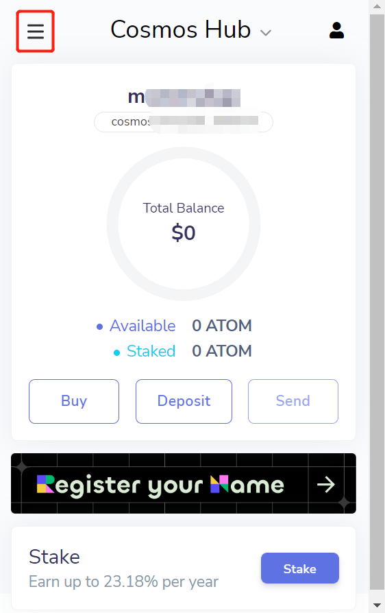
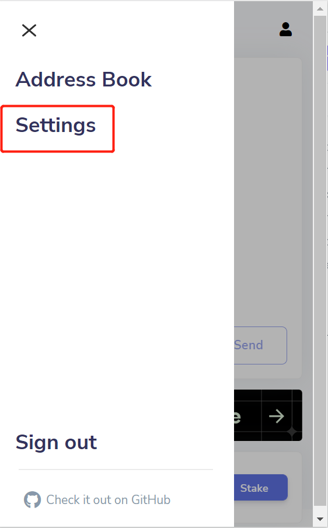
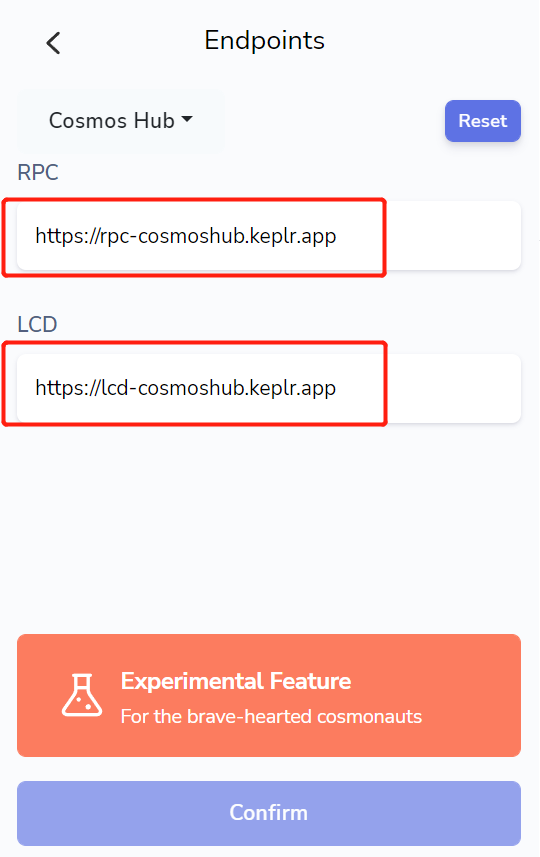

# Manually Change LCD and RPC Endpoint in Keplr

Below are the format of BlockPI Network Cosmos LCD and RPC endpoints. Make sure you create your own endpoints at [https://dashboard.blockpi.io/](https://dashboard.blockpi.io/)

```
https://cosmos.blockpi.network/lcd/v1/{api_key}
https://cosmos.blockpi.network/rpc/v1/{api_key}
```

***



Click the top left bottom and go to Settings.







Go to the tab of Endpoints. And the endpoints are default.







Change both endpoints with your BlockPI Network Cosmos endpoints, and confirm.

<figure><figcaption></figcaption></figure>


