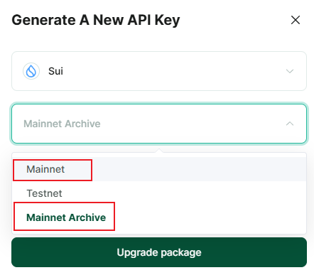

# SUI

BlockPI now supports full-stack data services for SUI, including full nodes, archival services, and indexer services. For details on their respective applicable use cases, please refer to the official [documentation](https://docs.sui.io/guides/developer/accessing-data/).&#x20;

Due to the characteristics of the data architecture, the endpoints for the full node and the indexer are within "SUI Mainnet". While using the archival service, users need to create a separate network endpoint with the name “SUI Mainnet Archive”.

Please note that JSON-RPC APIs are only for pruned data and can only be used with a Mainnet endpoint. Users requiring archival data should create a SUI Mainnet Archive endpoint and use gRPC.

SUI has announced plans to deprecate the JSON-RPC API. Please refer to the official SUI announcement for the specific timeline. As an official partner, BlockPI will align with SUI’s plan to phase out JSON-RPC support. 

<figure><figcaption></figcaption></figure>


Please see the example in [best-practices.md](../../../basic-tutorials/best-practices.md "mention")to use gRPC in SUI SDK

